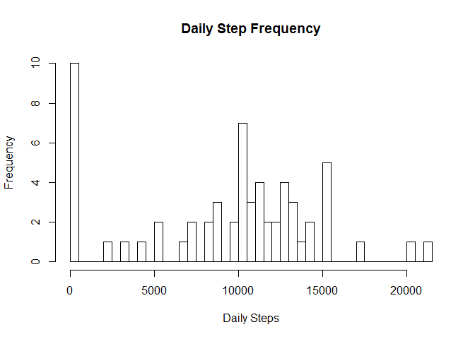
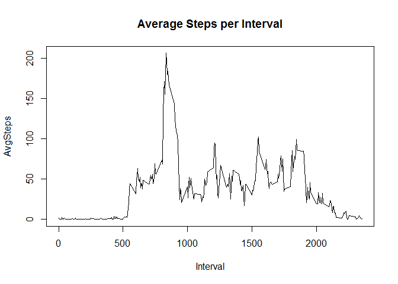
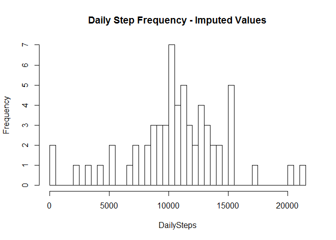
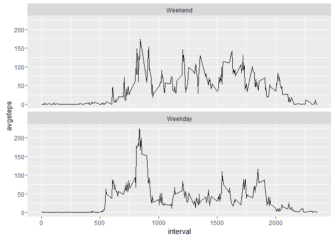

# Reproducible Research: Peer Assessment 1

This analysis is intended to evaluate and compare activity levels between weekdays and weekends as well as across daypart.

The assignment makes use of data from a personal activity monitoring device. This device collects data at 5 minute intervals through out the day. The data consists of two months of data from an anonymous individual collected during the months of October and November, 2012 and include the number of steps taken in 5 minute intervals each day.

##Load and PreProcess Data

To evalute the data we must first download the file from the source link and then load the data from the "activity.csv" file.  Once loaded, it is necessary to process the initial data into groupings that summarize step performance by date and interval subsets


```r
setwd("~") #set default directory
download.file("https://d396qusza40orc.cloudfront.net/repdata%2Fdata%2Factivity.zip", destfile = "activity.zip") 
unzip("activity.zip")
activity <- read.csv("activity.csv", stringsAsFactors = FALSE)
dailysteps <- aggregate(activity$steps, list(activity$date), sum, na.rm=TRUE)
names(dailysteps) <-c("Date","Steps")
intervalsteps <-aggregate(activity$steps, list(activity$interval), mean, na.rm=TRUE)
names(intervalsteps) <- c("Interval","AvgSteps")

#Load packages
install.packages("ggplot2", repos = "http://cran.us.r-project.org")
```

```
## Installing package into 'C:/Users/Derek Palmer/Documents/R/win-library/3.2'
## (as 'lib' is unspecified)
```

```r
library(ggplot2)
```

```
## Warning: package 'ggplot2' was built under R version 3.2.5
```

##What is mean total number of steps taken during the day

A histogram is provided to illustrate the total daily step frequency. 


```r
hist(dailysteps$Steps, breaks=50, xlab = "Daily Steps", main = "Daily Step Frequency")
```



```r
mean <- mean(dailysteps$Steps)
median <-median(dailysteps$Steps)
mean
```

```
## [1] 9354.23
```

```r
median
```

```
## [1] 10395
```

The mean daily steps are 9354.2295082 and the median daily steps are 10395.

##What is the average daily activity pattern?

Now we plot the steps by daily interval.


```r
plot(x=intervalsteps$Interval, y=intervalsteps$AvgSteps, type= "l", xlab="Interval", ylab="AvgSteps", main = "Average Steps per Interval")
```



```r
maxinterval <- intervalsteps[which.max(intervalsteps$AvgSteps),"Interval"]
maxinterval
```

```
## [1] 835
```

We see that the maximum interval is at 835

##Imputing Missing values


In this step we will impute some missing values using the mice package.  We will then compare a histogram that includes imputed values to our original data to see how the imputation impacts our results.  


```r
NaRows <- sum(!complete.cases(activity))

install.packages("mice", repos = "http://cran.us.r-project.org")
```

```
## Installing package into 'C:/Users/Derek Palmer/Documents/R/win-library/3.2'
## (as 'lib' is unspecified)
```

```r
library(mice)
```

```
## Warning: package 'mice' was built under R version 3.2.5
```

```
## Loading required package: Rcpp
```

```
## mice 2.25 2015-11-09
```

```r
activity_impute <- complete(mice(activity))
dailysteps_impute <- aggregate(activity_impute$steps, list(activity_impute$date), sum, na.rm=TRUE)
names(dailysteps_impute) <- c("Date","Steps")
```

Results

```r
hist(dailysteps_impute$Steps, breaks=50, xlab="DailySteps", main = "Daily Step Frequency - Imputed Values")
```



```r
meanstepsimpute <- mean(dailysteps_impute$Steps)
medianstepsimpute <- median(dailysteps_impute$Steps)
meanstepsimpute
```

```
## [1] 10736.43
```

```r
medianstepsimpute
```

```
## [1] 10600
```

Prior to imputing data there were 2304 rows that had NA values.  The new mean steps are 1.0736426\times 10^{4} and the new median step value is 10600

##Are there differences in activity patterns between weekdays and weekends?

Finally, we will compare average steps across intervals for weekdays compared to weekends.  


```r
activity_impute$dayofweek <- weekdays(as.Date(activity_impute$date))
weekdays1 <- c("Monday","Tuesday","Wednesday","Thursday","Friday")
activity_impute$weekday <- factor((activity_impute$dayofweek %in% weekdays1),levels = c(FALSE,TRUE),labels = c("Weekend","Weekday"))

intervalsubset<- aggregate(activity_impute$steps, by=list(activity_impute$interval,activity_impute$weekday), mean)
names(intervalsubset) <-c("interval","weekday","avgsteps")


panel <-ggplot(intervalsubset, aes(x=interval, y=avgsteps)) + geom_line()+facet_wrap(~ weekday, nrow = 2)
panel
```



The graphs suggest that weekend step activity usually starts later in the day but is more consistent throughout the day.  On weekdays the most significant activity occurs between 8 and 10am and then falls to a lower baseline throughout the rest of the day.
